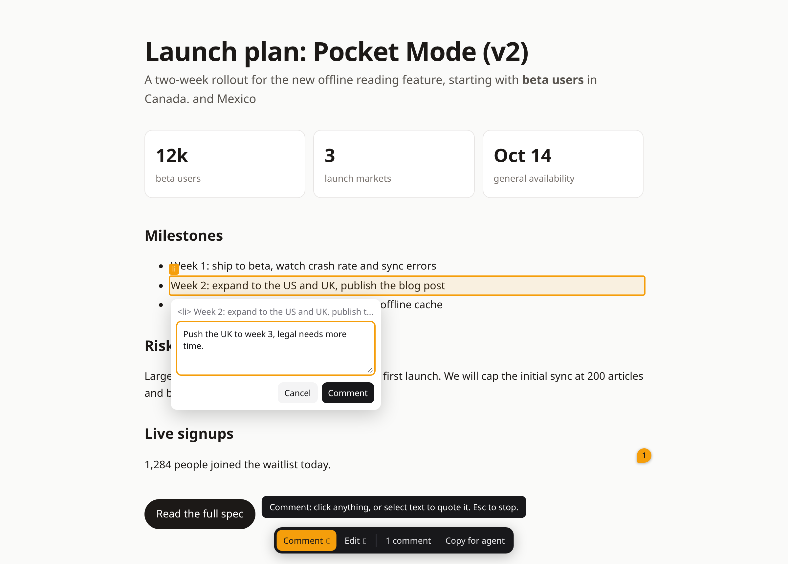

# htmlpen

Comment on and edit local HTML in your browser, and send the review straight to your coding agent.



```sh
npx htmlpen report.html   # or a folder
```

Press **C** to pin a comment on anything (select text to quote it), **E** to edit text in place (`Enter` saves to the file), **Esc** to browse. Comments save to `report.html.comments.json`; **Copy for agent** puts them on your clipboard as a prompt. The page live-reloads as your agent edits the file.

## With Claude Code

```
/plugin install htmlpen --marketplace eshamanideep/htmlpen
```

When Claude writes an HTML page, it hands it to you in htmlpen (the `/htmlpen:review-html` skill, plus a hook that reminds Claude to use it). Review it, press **Send to Claude**, and the review lands back in the session. It works locally and in [Conductor](https://conductor.build) cloud workspaces, where the page is shared at the workspace preview URL and only the printed link can edit.

[Artifacts](https://code.claude.com/docs/en/artifacts): htmlpen can't run inside a published artifact, but it reviews the artifact's local file, and Claude republishes to the same link.

What it runs: a local server on `127.0.0.1` for the page you're reviewing. Two hooks watch Claude's Write and Bash calls for new `.html` files (keeping a short list in your temp folder): Claude gets a reminder to hand each page over, and one prompt if it tries to finish without doing so. In Conductor it also calls the `conductor` CLI to share the preview link and post your review to the chat. Nothing else leaves your machine; details in [PRIVACY.md](PRIVACY.md).

Other agents: tell them to apply the unresolved entries in `<file>.comments.json` and set `"resolved": true`.

## Safe edits

- Only the edited element's content is rewritten; the rest of the file stays byte-for-byte identical.
- Anything it can't write exactly (script-rendered text, non-UTF-8 files, unusual markup) becomes a comment instead, so nothing you type is lost.
- Localhost only, no dotfiles, no cross-site writes. `npm run test:browser` edits 102 elements across 13 tricky pages in Chrome and fails on any corruption.

## Develop

```sh
npm install && npm test && npm run test:browser
node src/cli.js examples/launch-plan.html
```

MIT licensed.
